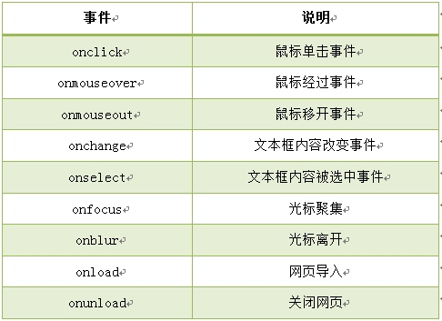
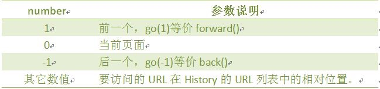
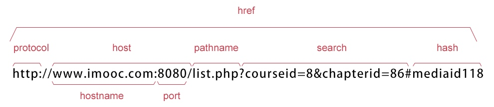
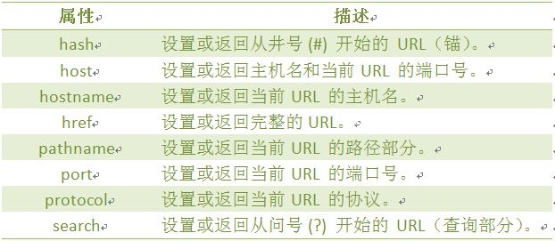
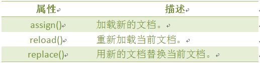
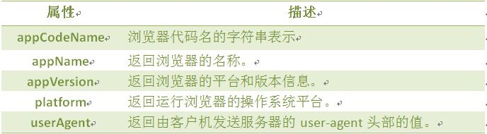
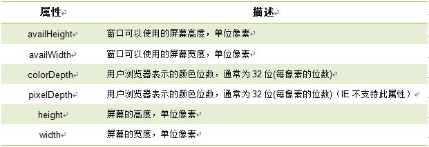
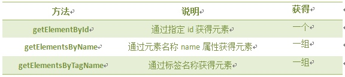

# JavaScript进阶篇
<!-- TOC depthFrom:1 depthTo:6 withLinks:1 updateOnSave:1 orderedList:0 -->

- [JavaScript进阶篇](#javascript进阶篇)
	- [事件](#事件)
		- [鼠标单击事件( onclick ）](#鼠标单击事件-onclick-)
		- [鼠标经过事件（onmouseover）](#鼠标经过事件onmouseover)
		- [鼠标移开事件（onmouseout）](#鼠标移开事件onmouseout)
		- [光标聚焦事件（onfocus）](#光标聚焦事件onfocus)
		- [失焦事件（onblur）](#失焦事件onblur)
		- [内容选中事件（onselect）](#内容选中事件onselect)
		- [文本框内容改变事件（onchange）](#文本框内容改变事件onchange)
		- [加载事件（onload）](#加载事件onload)
		- [卸载事件（onunload）](#卸载事件onunload)
		- [编程练习](#编程练习)
	- [JavaScript内置对象](#javascript内置对象)
		- [什么是对象](#什么是对象)
		- [Data日期对象](#data日期对象)
			- [返回/设置年份方法](#返回设置年份方法)
			- [返回星期方法](#返回星期方法)
			- [返回/设置时间方法](#返回设置时间方法)
		- [String 字符串对象](#string-字符串对象)
			- [返回指定位置的字符](#返回指定位置的字符)
			- [返回指定的字符串首次出现的位置](#返回指定的字符串首次出现的位置)
			- [字符串分割split()](#字符串分割split)
			- [提取字符串substring()](#提取字符串substring)
			- [提取指定数目的字符substr()](#提取指定数目的字符substr)
		- [Math对象](#math对象)
			- [向上取整ceil()](#向上取整ceil)
			- [向下取整floor()](#向下取整floor)
			- [四舍五入round()](#四舍五入round)
			- [随机数 random()](#随机数-random)
		- [Array 数组对象](#array-数组对象)
			- [数组连接concat()](#数组连接concat)
			- [指定分隔符连接数组元素join()](#指定分隔符连接数组元素join)
			- [颠倒数组元素顺序reverse()](#颠倒数组元素顺序reverse)
			- [选定元素slice()](#选定元素slice)
			- [数组排序sort()](#数组排序sort)
	- [浏览器对象](#浏览器对象)
		- [window对象](#window对象)
		- [JavaScript 计时器](#javascript-计时器)
			- [计时器setInterval()](#计时器setinterval)
			- [取消计时器clearInterval()](#取消计时器clearinterval)
			- [计时器setTimeout()](#计时器settimeout)
			- [取消计时器clearTimeout()](#取消计时器cleartimeout)
		- [History对象](#history对象)
			- [返回前一个浏览的页面](#返回前一个浏览的页面)
			- [返回下一个浏览的页面](#返回下一个浏览的页面)
			- [返回浏览历史中的其他页面](#返回浏览历史中的其他页面)
		- [Location对象](#location对象)
		- [Navigator对象](#navigator对象)
			- [userAgent](#useragent)
		- [screen对象](#screen对象)
			- [屏幕分辨率的高和宽](#屏幕分辨率的高和宽)
			- [屏幕可用高和宽度](#屏幕可用高和宽度)
	- [DOM对象，控制HTML元素](#dom对象控制html元素)
		- [认识DOM](#认识dom)
			- [getElementsByName()方法](#getelementsbyname方法)
			- [getElementsByTagName()方法](#getelementsbytagname方法)
			- [区别getElementByID,getElementsByName,getElementsByTagName](#区别getelementbyidgetelementsbynamegetelementsbytagname)
			- [getAttribute()方法](#getattribute方法)
			- [setAttribute()方法](#setattribute方法)
		- [节点属性](#节点属性)
			- [访问子节点childNodes](#访问子节点childnodes)
			- [访问子节点的第一和最后项](#访问子节点的第一和最后项)
			- [访问父节点parentNode](#访问父节点parentnode)
			- [访问兄弟节点](#访问兄弟节点)
			- [插入节点appendChild()](#插入节点appendchild)
			- [插入节点insertBefore()](#插入节点insertbefore)
			- [删除节点removeChild()](#删除节点removechild)
			- [替换元素节点replaceChild()](#替换元素节点replacechild)
			- [创建元素节点createElement](#创建元素节点createelement)
			- [创建文本节点createTextNode](#创建文本节点createtextnode)
			- [浏览器窗口可视区域大小](#浏览器窗口可视区域大小)
			- [网页尺寸scrollHeight](#网页尺寸scrollheight)
			- [网页尺寸offsetHeight](#网页尺寸offsetheight)
			- [网页卷去的距离与偏移量](#网页卷去的距离与偏移量)

<!-- /TOC -->
数组长度可变

```js
<script type="text/JavaScript">
 var myarr = new Array(8);
 myarr[9] = 9;
 document.write("数组的第一个值："+myarr[0]);
 document.write("数组的第一个值："+myarr[9]);
</script>
```

```js
arr.length=10; //增大数组的长度
document.write(arr.length); //数组长度已经变为10
```

## 事件

### 鼠标单击事件( onclick ）
`<input name="button" type="button" value="点击提交" onclick="add2()" />`
### 鼠标经过事件（onmouseover）
`<input name="确定" type="button" value="确定" onmouseover="message()"/>`
### 鼠标移开事件（onmouseout）
事件放在对象内部
`<a href="http://www.imooc.com" onmouseout="message()">点击我</a>`
### 光标聚焦事件（onfocus）
选择了改对象
`<select name="career" onfocus="message()">`
### 失焦事件（onblur）
`密码:<input name="password" type="text" value="请输入密码！" onblur="message()">`
### 内容选中事件（onselect）
需双击选中  
`<textarea name="summary" cols="60" rows="5" onselect="message()">请写入个人简介，不少于200字！</textarea>`
### 文本框内容改变事件（onchange）
### 加载事件（onload）
### 卸载事件（onunload）
### 编程练习
加减乘除计算器
注意: 使用parseInt()函数可解析一个字符串,并返回一个整数

## JavaScript内置对象
### 什么是对象
JavaScript 中的所有事物都是对象，如:字符串、数值、数组、函数等，每个对象带有属性和方法。

对象的属性：反映该对象某些特定的性质的，如：字符串的长度、图像的长宽等；

对象的方法：能够在对象上执行的动作。例如，表单的“提交”(Submit)，时间的“获取”(getYear)等；

### Data日期对象
`var Udate=new Date(); `  
Date()的首字母必须大写。  
使 Udate 成为日期对象，并且已有初始值：当前时间(当前电脑系统时间)。

#### 返回/设置年份方法
`get/setFullYear() `  
返回/设置年份，用四位数表示。
#### 返回星期方法
`getDay() `  
返回星期，返回的是0-6的数字，0 表示星期天
#### 返回/设置时间方法
`get/setTime()`   
返回/设置时间，单位毫秒数，计算从 1970 年 1 月 1 日零时到日期对象所指的日期的毫秒数。
### String 字符串对象
#### 返回指定位置的字符
`stringObject.charAt(index)`
#### 返回指定的字符串首次出现的位置
`stringObject.indexOf(substring, startpos)`  
可选参数，从stringObject的startpos位置开始查找substring，如果没有此参数将从stringObject的开始位置查找。
#### 字符串分割split()
`stringObject.split(separator,limit)`  
limit 最多分成几个
#### 提取字符串substring()
`stringObject.substring(startPos,stopPos) `  
startPos 到 stopPos - 1
#### 提取指定数目的字符substr()
`stringObject.substr(startPos,length)`
### Math对象  
Math 对象是一个固有的对象，无需创建它，直接把 Math 作为对象使用就可以调用其所有属性和方法。这是它与Date,String对象的区别
#### 向上取整ceil()
`Math.ceil(x)`
#### 向下取整floor()
`Math.floor(x)`
#### 四舍五入round()
`Math.round(x)`  
如果 x 与两侧整数同等接近，则结果接近 +∞方向的数字值 。(如 -5.5 将舍入为 -5; -5.52 将舍入为 -6)
#### 随机数 random()
random() 方法可返回介于 0 ~ 1（大于或等于 0 但小于 1 )之间的一个随机数。  
`Math.random();`
### Array 数组对象
#### 数组连接concat()
`arrayObject.concat(array1,array2,...,arrayN)`  
每个数组的元素中间有，隔开
#### 指定分隔符连接数组元素join()
`arrayObject.join(分隔符)`  
把一个数组中各个元素连起来 用，隔开
#### 颠倒数组元素顺序reverse()
`arrayObject.reverse()`
#### 选定元素slice()
`arrayObject.slice(start,end)`  
可以使用负数 从尾部选取元素  
start 到end - 1
#### 数组排序sort()
`arrayObject.sort(方法函数)`  
如果指定<方法函数>，则按<方法函数>所指定的排序方法排序。

myArray.sort(sortMethod);  
注意: 该函数要比较两个值，然后返回一个用于说明这两个值的相对顺序的数字。比较函数应该具有两个参数 a 和 b，其返回值如下：

若返回值`<=-1`，则表示a在排序后的序列中出现在b之前。  
若返回值`>-1 && <1`，则表示a和b具有相同的排序顺序。  
若返回值`>=1`，则表示a在排序后的序列中出现在b之后。

##  浏览器对象
### window对象
### JavaScript 计时器
#### 计时器setInterval()
`setInterval(代码,交互时间);`  
`setInterval(clock,1000)`
#### 取消计时器clearInterval()
`clearInterval(id_of_setInterval)`

```js
var i=setInterval("clock()",100);
<input type="button" value="Stop" onclick="clearInterval(i)"  />
```
#### 计时器setTimeout()
`setTimeout(代码,延迟时间);`
#### 取消计时器clearTimeout()
`clearTimeout(id_of_setTimeout)`

### History对象
history对象记录了用户曾经浏览过的页面(URL)，并可以实现浏览器前进与后退相似导航的功能。
`window.history.[属性|方法]`

```js
<script type="text/javascript">
  var HL = window.history.length;
  document.write(HL);
</script>
```
#### 返回前一个浏览的页面
`window.history.back();`
#### 返回下一个浏览的页面
`window.history.forward();`
#### 返回浏览历史中的其他页面
`window.history.go(number);`


### Location对象
  

  



### Navigator对象
Navigator 对象包含有关浏览器的信息，通常用于检测浏览器与操作系统的版本。


#### userAgent
`navigator.userAgent`

### screen对象
`window.screen.属性`


#### 屏幕分辨率的高和宽
`screen.height` 返回屏幕分辨率的高
`screen.width` 返回屏幕分辨率的宽
#### 屏幕可用高和宽度
`screen.availWidth` 属性返回访问者屏幕的宽度，以像素计，减去界面特性，比如任务栏。

`screen.availHeight` 属性返回访问者屏幕的高度，以像素计，减去界面特性，比如任务栏。

## DOM对象，控制HTML元素
### 认识DOM
#### getElementsByName()方法
`document.getElementsByName(name)`
因为文档中的 name 属性可能不唯一，所有 getElementsByName() 方法返回的是元素的数组，而不是一个元素,所以是elements
#### getElementsByTagName()方法
`document.getElementsByTagName(Tagname)`
#### 区别getElementByID,getElementsByName,getElementsByTagName

```js
<input type="checkbox" name="hobby" id="hobby1">  //音乐
```
input标签就像人的类别。

name属性就像人的姓名。

id属性就像人的身份证。  


#### getAttribute()方法
先通过getElementByID,getElementsByName,getElementsByTagName得到元素节点，再获取属性
`elementNode.getAttribute(name)`
#### setAttribute()方法
`elementNode.setAttribute(name,value)`  
1.name: 要设置的属性名。  
2.value: 要设置的属性值。

### 节点属性
在文档对象模型 (DOM) 中，每个节点都是一个对象。DOM 节点有三个重要的属性 ：

1. nodeName : 节点的名称

2. nodeValue ：节点的值

3. nodeType ：节点的类型

一、nodeName 属性: 节点的名称，是只读的。

1. 元素节点的 nodeName 与标签名相同
2. 属性节点的 nodeName 是属性的名称
3. 文本节点的 nodeName 永远是 #text
4. 文档节点的 nodeName 永远是 #document

二、nodeValue 属性：节点的值

1. 元素节点的 nodeValue 是 undefined 或 null
2. 文本节点的 nodeValue 是文本自身
3. 属性节点的 nodeValue 是属性的值

三、nodeType 属性: 节点的类型，是只读的。以下常用的几种结点类型:

元素类型    节点类型
  元素          1
  属性          2
  文本          3
  注释          8
  文档          9

#### 访问子节点childNodes
`elementNode.childNodes`
子节点能有多个 所以有长度
#### 访问子节点的第一和最后项
`node.firstChild`
`node.firstChild`
#### 访问父节点parentNode
`elementNode.parentNode`
父节点只有一个
访问祖节点:
`elementNode.parentNode.parentNode`
#### 访问兄弟节点
1. nextSibling 属性可返回某个节点之后紧跟的节点（处于同一树层级中）。
`nodeObject.nextSibling`
说明：如果无此节点，则该属性返回 null。

2. previousSibling 属性可返回某个节点之前紧跟的节点（处于同一树层级中）。
`nodeObject.previousSibling `
#### 插入节点appendChild()
需要先create一个node，赋值，然后append

```js
<script type="text/javascript">

  var otest = document.getElementById("test");  
  var newnode = document.createElement("li");
  var newtext= document.createTextNode("PHP");
  newnode.appendChild(newtext);
  otest.appendChild(newnode);

</script>
```
#### 插入节点insertBefore()
insertBefore() 方法可在已有的子节点前插入一个新的子节点。
`insertBefore(newnode,node);`
参数:
newnode: 要插入的新节点。
node: 指定此节点前插入节点。

#### 删除节点removeChild()
`nodeObject.removeChild(node)`
removeChild() 方法从子节点列表中删除某个节点。如删除成功，此方法可返回被删除的节点，如失败，则返回 NULL。
#### 替换元素节点replaceChild()
`node.replaceChild (newnode,oldnew ) `
#### 创建元素节点createElement
`document.createElement(tagName)`
#### 创建文本节点createTextNode
`document.createTextNode(data)`
#### 浏览器窗口可视区域大小
•  window.innerHeight - 浏览器窗口的内部高度

•  window.innerWidth - 浏览器窗口的内部宽度
#### 网页尺寸scrollHeight
scrollHeight和scrollWidth，获取网页内容高度和宽度
#### 网页尺寸offsetHeight
offsetHeight和offsetWidth，获取网页内容高度和宽度(包括滚动条等边线，会随窗口的显示大小改变)。
#### 网页卷去的距离与偏移量
