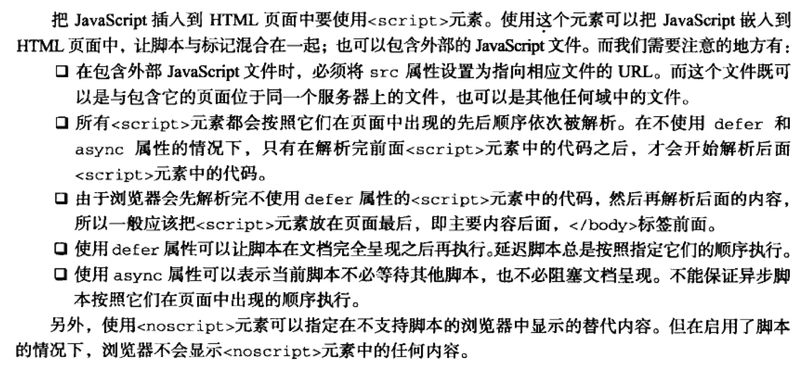

# 第一章 JavaScript简介
## JavaScript实现
ECMAScript + DOM + BOM

# 第二章 在HTML中使用JavaScript
## `<script>`元素
标签的位置: 放到\<body>的最后  
延迟脚本: defer 只适用于外部脚本  
异步脚本: async 只适用于外部脚本

# 第三章 基本概念
ECMAScript的变量是松散类型，可以一哦你过来保存任何类型的数据。

```js
var message = "hi";
message = 100 //有效
```
基本数据类型: Undefined, null, boolean, number, string, (object)  
返回类型typeof()  
数值转换 Number(), parseInt(), parseFloat()


# 第四章 变量、作用域和内存问题
基本类型、引用类型  
执行环境及作用域  
作用域链的前端，始终都是当前执行的代码所在环境的变量对象  
延长作用域链（with语句）p75  
声明变量 有var 加到最近的环境中 没有var 自动加到全局环境中  
查询标识符 从作用域链前端开始 向上逐级查询  
垃圾收集
* 清除标记
* 引用计数


# 第五章 引用类型
